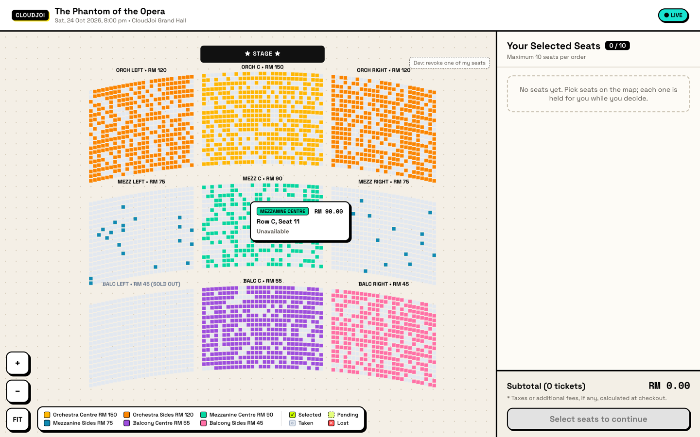
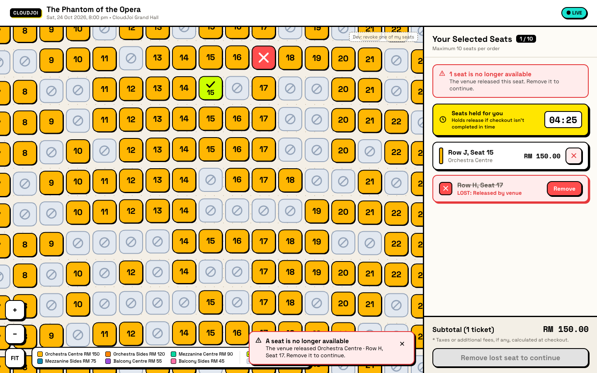
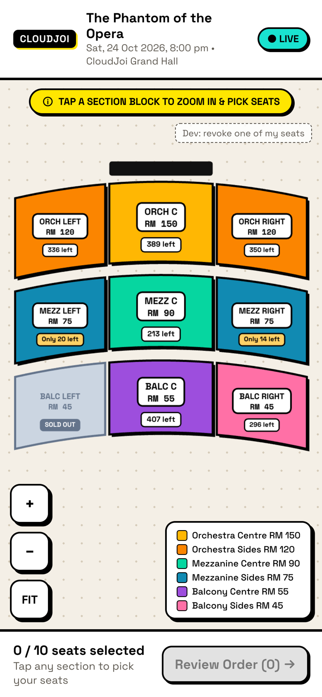
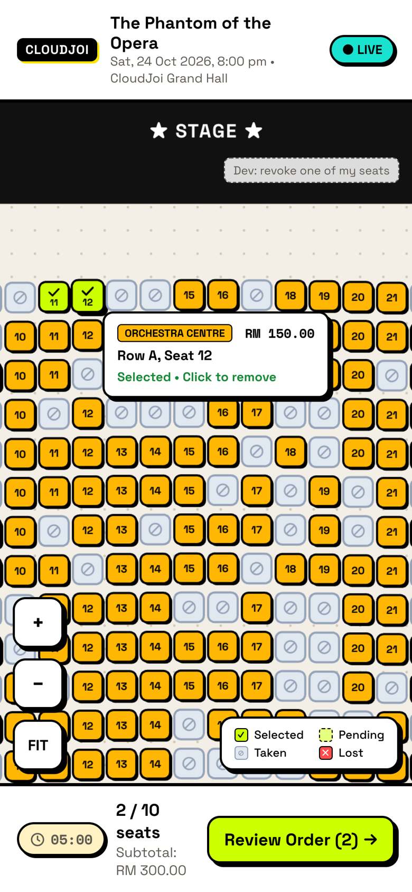

# CloudJoi Seat Selection

A seat-selection SPA for one event: pick exact seats from a live, 4,592-seat seatmap while other buyers are doing the same. React + TypeScript, seats drawn on a single `<canvas>`, real-time updates over Laravel Reverb (WebSocket), and a fake backend built into the dev server so everything works with no other services.

| Desktop | Lost-seat flow | Mobile overview | Mobile close zoom |
|---|---|---|---|
|  |  |  |  |

## Run it

Needs Node 22.18+ (developed on Node 25); `npm run seatmap` runs TypeScript directly with Node's type stripping.

```bash
npm install
npm run dev          # http://localhost:5173, fake API + fake Reverb included
```

Things to try:

- **Two buyers:** open the page in two browsers (or a normal and a private window). Seats one holds turn grey in the other within a second; they share one fake backend.
- **Your phone:** `npm run dev -- --host`, then open the printed network URL. Same shared state.
- **A seat taken from you:** click *Dev: revoke one of my seats* (top right of the map, dev builds only). The venue revokes one of your holds and the lost-seat flow runs. `MOCK_REVOKE=on npm run dev` makes the fake venue also do this on its own, about every two minutes.
- **Hold expiry without waiting 5 minutes:** `MOCK_HOLD_SECONDS=30 npm run dev`.
- **A quiet venue:** `MOCK_BOTS=off npm run dev` stops the simulated buyers. `MOCK_LATENCY=0` removes the artificial response delay (default up to 250 ms, so the pending state is visible).

| Script | What it does |
|---|---|
| `npm run dev` | Vite dev server with the fake API (`/api`) and fake Reverb (`/app/{key}`) inside it |
| `npm run local` | Same app, `/api` proxied to a local Laravel backend (`BACKEND_URL`, default `:8000`), Reverb from `.env.backend` |
| `npm run build` / `npm run preview` | Production build; talks to `VITE_API_BASE_URL` / `VITE_REVERB_*` in `.env.production` (empty until a production backend exists, so `preview` shows the retry screen) |
| `npm test` | Vitest: store transitions, hit testing, viewport math, fake-backend concurrency |
| `npm run lint` | oxlint |
| `npm run api:types` | Regenerate `src/api/schema.d.ts` from `api/openapi.yaml` |
| `npm run seatmap` | Regenerate the demo venue in `mock/data/` |

The browser code is identical in all three modes; only where `/api` and the socket point changes. (`local` runs Vite mode `backend` because Vite reserves the mode name `local`.)

## How it fits together

```
 api/openapi.yaml ── contract shared by SPA, fake API and the future Laravel backend
        │
 ┌──────┴───────┐        HTTP: seatmap, availability(?since), holds, checkout
 │ state/actions │ ◄───── Reverb: "seats.changed" {seq, changes}
 └──────┬───────┘
        │ writes
 ┌──────▼───────┐
 │  seatStore    │  one store: availability, my holds, expiry, connection, notices
 └──┬────────┬──┘
    │        │ useStore(selector)                     subscribe()
    │   ┌────▼──────────────┐                    ┌────▼─────────────────┐
    │   │ SelectionPanel     │ desktop sidebar    │ SeatMapRenderer       │ canvas, no React
    │   │ BottomBar / Sheet  │ mobile             │ (seatmap/renderer.ts) │ per seat
    │   └────────────────────┘                    └──────────────────────┘
```

- **State lives in one store** (`state/actions.ts`); every change goes through an action. The map and the sidebar never talk to each other: clicking a seat calls `toggleSeat`, the ✕ in the sidebar calls `removeSeat`, and both views re-read the store. A third panel tomorrow (say, "seats near you") would read the same store through `useSelection()` and need nothing else.
- **React never renders seats.** The renderer subscribes to the store directly and redraws the canvas at most once per frame. React only renders the chrome (panel, legend, tooltip, dialogs), so a click re-renders a few small components, not 4,592 seats.
- **Pure logic is separate and tested:** `state/seats.ts` (snapshot/delta, merging server hold sets with in-flight holds, clock-skew-corrected expiry), `seatmap/model.ts` (spatial-hash hit testing, finding the neighbouring section), `seatmap/viewport.ts` (pan/zoom math, keeping a section in view), `mock/venue.ts` (the fake backend's concurrency rules).

## Two levels: all sections, then one section

The map has two levels, the same on desktop and mobile:

1. **All sections.** The venue fitted to the screen as 9 section blocks with live "N left" / "Only N left" / "SOLD OUT" chips. No pan or zoom; the only thing to do is pick a section. Sold-out sections can't be entered.
2. **One section.** Tapping a block flies into that section. Its seats are sharp and clickable; every other section stays on the map, **faded and blurred**, like the unexplored part of an open-world map, so you keep your bearings without being able to misclick a seat you didn't mean to look at. You can zoom in to seat numbers, and out to 60% of the fitted section to see the surroundings. Panning is held to the section: drag past its edge and it stretches a little (rubber band) and springs back, and a **"Go to ‹section› →"** button appears on that side, naming the nearest open section in that direction. "← All sections" returns to level 1.

Why: at 4,600 seats, the whole venue at once gives desktop users specks and phone users nothing tappable. Choosing a section first (price and availability at a glance) and then a seat splits one hard decision into two easy ones, and it caps what's drawn sharp to one section.

Details:

- **Where you land.** With a mouse, on the whole section. On touch screens (`pointer: coarse`), on its front rows at finger size (32 px seats), since a fitted section on a phone gives ~12 px seats. Pinch out to see the whole section.
- **The blur** is the other sections' seats drawn into a canvas at ¼ size and scaled back up, so the smoothing blurs them, at 45% opacity. `ctx.filter = 'blur()'` would be simpler but is missing in older Safari and blurs every draw call separately, which with thousands of seat rects is far too slow. Blurred seats get no hover and ignore taps.
- **The edge button** appears once you drag 60 px past the edge, and goes away when you start another drag. It skips sold-out sections and prefers the section straight ahead over a diagonal one.

## Key decisions and trade-offs

### Canvas, not SVG or DOM

The brief asks about JSON vs SVG vs canvas vs DOM. Data is JSON either way (seat coordinates come from the API); the real choice is how to draw it.

- **DOM / SVG:** one element per seat. Simple, accessible per seat, fine up to about 1,000 seats. At 4,600+ seats every pan and zoom frame restyles thousands of nodes, which is where older phones stutter.
- **Canvas (chosen):** one element. Most large ticketing seatmaps (e.g. seats.io, SeatGeek) draw seats on canvas for this reason. The cost is that I own hit testing, hover, crisp high-DPI drawing and accessibility.
- **WebGL:** only needed for stadiums of 50k+ seats; it also has the most compatibility risk on old devices.

What makes it fast, measured in headless Chrome on an M3 Pro while zooming continuously:

| | Median frame | p95 frame |
|---|---|---|
| Whole venue visible (4,592 seats), first version with rounded paths | 50 ms | 54 ms |
| Whole venue visible, batched `fillRect`s (current drawing) | 16.7 ms | 16.7 ms |
| Close zoom | 16.7 ms | 16.8 ms |

Same numbers at 2× device pixel ratio. These were measured before the two-level map, when desktop showed every seat at once; that is still the worst case (a section zoomed out, with most of the venue drawn around it, blurred), but I haven't re-measured it. The techniques:

- **Level of detail.** Level 1 draws 9 section blocks, not seats. Inside a section, detail is keyed on on-screen seat size: below 28 px, seats are plain squares batched into one pass per colour; from 28 px, the full design (shadow, number, ✓ / ✕ / ⊘ marks, row labels), but only for the ~100 seats on screen. Seats of other sections are always the cheap squares, drawn at ¼ size for the blur.
- **Culling:** seats outside the viewport are skipped. That is canvas's version of virtualization.
- **Canvas sized to the viewport, not the venue, with DPR capped at 2.** A 3× phone screen would cost 2.25× the pixels for no visible difference, and iOS limits total canvas memory.
- **Hit testing:** a spatial hash, so a click checks ~9 cells rather than 4,592 seats. The whole seat cell (32 px at close zoom) is the tap target, bigger than the 28 px drawn seat.
- **No `ctx.roundRect`**, which is missing before Safari 16.

Not measured: real old phones and CPU-throttled devices. That's the first thing I'd do next (see below).

**Accessibility cost of canvas:** individual seats aren't in the accessibility tree. The selection panel is the accessible path (the list, remove buttons, timer, lost-seat alerts with `role="alert"`, checkout with a stated reason when disabled), and seat states never rely on colour alone. Keyboard navigation of the map itself is cut (below).

### No virtualization

List virtualization doesn't map onto a 2D, zoomable seatmap. Viewport culling plus level of detail does the same job, and the rest of the venue stays visible (blurred) around the section you're in.

### A tiny store instead of a state library

`state/store.ts` is about 35 lines on React's `useSyncExternalStore`: `get`, `set`, `subscribe`, and a `useStore(selector)` hook. It gives what Zustand would (selector subscriptions, a store the canvas can subscribe to outside React) without a dependency. If the app grew devtools and middleware needs, it's a drop-in swap for Zustand, because the API is the same shape. Redux felt heavy for one store and a dozen actions.

### Holding seats on click (a deliberate deviation from the brief)

The brief has selection as purely local, with other buyers "reserving" seats. I made clicking a seat **hold it on the server** for 5 minutes, like cinema sites do:

- Otherwise two people can pick the same seat, and one finds out at payment. A hold makes the server the referee: of any number of concurrent requests for a seat, exactly one wins, and the rest get `409 SEAT_UNAVAILABLE`, shown as a "Seat just taken" notice.
- It is what makes a second browser *see* your selection.
- All holds in an order share **one expiry**, 5 minutes from the first seat. Adding seats doesn't extend it (otherwise add/remove would hold seats forever). There is a countdown in the panel and a warning at 1 minute; on expiry, a "Hold expired" sheet lists what was released.
- Consequence: the brief's "a seat you selected becomes unavailable externally" can no longer happen through someone else clicking it. It happens when **the venue revokes a hold** (or it expires). A revoked seat turns red with ✕ on the map, stays in the panel struck through as "LOST: Released by venue" with a banner and a notice, and checkout is blocked with that reason until it's removed. That's the dev button, and `MOCK_REVOKE=on` for occasional automatic revocation.
- Also: optimistic UI (the seat shows as pending immediately), a 10-seat limit, and repeated clicks on a pending seat are ignored, so fast clicking can't reorder hold/release requests.
- Closing the tab does **not** release holds early. A last-second beacon is unreliable on phones and would lose your seats on a reload. The session token lives in `localStorage`, so a reload restores your selection; abandoned holds cost other buyers up to 5 minutes.

### Real-time updates: the WebSocket is already in

The brief asks how I'd handle updates if a WebSocket were added later. It's in: `api/realtime.ts` subscribes with `laravel-echo` to Reverb's public channel `events.{id}.seats`. The design choices that make it trustworthy:

- **Every broadcast carries a `seq`.** The client applies one only if it's exactly `lastSeq + 1`; a gap means a missed message, and the client calls `GET /availability?since=lastSeq`, which returns the net changes (or a fresh snapshot if the server's history doesn't go back that far).
- **The same catch-up runs** when the socket reconnects and when a hidden tab becomes visible again (mobile browsers freeze background tabs), so a stale map fixes itself within one request.
- **The public feed only says available/unavailable**; it never reveals who holds a seat. Changes to *your* holds are detected without a private channel: any change to a hold is broadcast for that seat even if its public status didn't change, and a broadcast touching one of your seats makes the client refetch `GET /holds`.
- **Clock skew:** countdowns use the server's `expires_at` and `server_time`, not a local timer, so a frozen tab or a wrong phone clock can't show the wrong time.
- A connection badge (LIVE / RECONNECTING) plus a banner: "Live updates paused. Your seats stay held until the timer ends."

### Contract first, fake backend inside Vite

`api/openapi.yaml` was written before any UI. TypeScript types are generated from it (`openapi-typescript`) and used through a typed client (`openapi-fetch`). The Reverb message format is documented in the same file under `x-realtime`, since OpenAPI can't describe sockets.

The dev backend (`mock/`) is a Vite plugin implementing that contract over **real HTTP and a real WebSocket** (a minimal Pusher-protocol server, which is what Reverb speaks). This is why `npm run dev` needs nothing else, why two browsers or a phone share state, and why dev exercises exactly the network code production uses. I chose it over MSW, which runs inside each tab and so can't share state between browsers. It never ships: the plugin only exists in dev mode.

### Mobile first

- **Phones and tablets** (below 1024 px, where tablets get the mobile layout centred with side margins) get the same two levels as desktop, landing on a section's front rows at finger size (see above). Zoomed out inside a section, a touch tap zooms in rather than selects; a mouse click selects.
- **Selection** is a bottom bar (timer, count, subtotal, "Review Order") plus a native `<dialog>` sheet with the same `SelectionPanel` the desktop sidebar uses. Using `<dialog>` gives focus trapping, Esc and the backdrop for free.
- **Desktop** shows a hover tooltip (section, row, seat, price, status), and a pointer cursor over enterable section blocks.

### Other notes

- **Money** is integer minor units (sen) end to end; fees are out of scope, so the panel shows a subtotal with "fees calculated at checkout". Tier colours live in the frontend theme, not the API.
- **Design:** mockups and the designer's handoff are in `docs/design/`. I deviated in a few places: the design's overview → seats zoom threshold became the two explicit levels; the seats → close threshold is keyed on on-screen seat size, which is what the design's 1.2 scale threshold describes for our layout units; desktop (mockups 09 and 12) opens on section blocks rather than every seat; seats at mid zoom are square rather than rounded (the rounding is invisible at that size and was the main per-frame cost); and the legend adapts to the zoom level.

## What I cut

- **Keyboard navigation of the map.** 4,600 tab stops is useless; it needs its own design (e.g. arrow keys between seats, or a "best available" picker). The panel is fully keyboard-accessible.
- Extending a hold ("need more time?"), a best-available picker, filtering by price, multiple events.
- Real checkout and payment. Checkout calls the stub endpoint, logs the order to the console and clears the basket.
- Private channels, and user accounts (sessions are anonymous tokens).
- End-to-end tests and contract tests (checking the fake API against the YAML). I verified flows by hand in Chrome at desktop and iPhone sizes, including a two-browser session.
- A minimap, touch haptics, dark mode, translations.

## What I'd do with more time

1. **Measure on real low-end devices** (and with Chrome's CPU throttling) and tune the level-of-detail thresholds. Only a fast laptop has been measured so far.
2. **Scale test at 20k+ seats** (`scripts/generate-seatmap.ts` takes the section sizes). If mid zoom slows down, cache the static seat layer in an offscreen canvas and only repaint changed seats, or move to WebGL for stadiums.
3. **Playwright end-to-end tests** for the flows above, run against the fake API, including two browser contexts competing for one seat.
4. **Contract tests** that validate every fake-API response against `openapi.yaml`, then the same suite against the Laravel backend.
5. **Keyboard/screen-reader access to the map**, e.g. a row-by-row seat list per section that shares the canvas's selection.
6. Code-split `pusher-js` / `laravel-echo` (about 21 KB of the 103 KB gzipped bundle) so the map paints before the socket library loads.

## For the Laravel backend

The contract assumes the backend will:

- make `POST /holds` atomic per seat (a conditional `UPDATE … WHERE status = 'available' OR expired` and a check of affected rows, or a row lock);
- lock the session row when enforcing the 10-seat limit, so two fast clicks can't both pass the count;
- broadcast **after** the transaction commits, with `seq` increasing by exactly 1 per event;
- run a scheduled sweep that releases expired holds **and broadcasts it**, since expiry marked only in the database would leave every viewer's map stale;
- keep enough change history for `?since=`, falling back to a snapshot.
